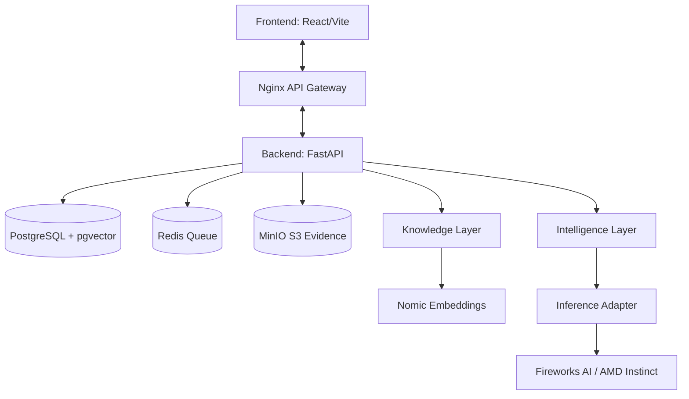

# Helix Architecture

Helix is designed with a strict separation of concerns, ensuring deterministic behavior, auditability, and speed.

## High-Level Architecture

## Frontend
Built with **React**, **Vite**, and **Tailwind CSS**. It follows an enterprise-grade dark-mode aesthetic. State management and data fetching are handled by **React Query**, ensuring real-time synchronization with the backend. 

## Backend
Built with **Python** and **FastAPI**. It enforces strict Pydantic schemas for all inputs and outputs. The backend coordinates the retrieval of organizational data, the processing of evidence, and the invocation of the AI reasoning engine.

## Database & Organization Memory
The core of Helix is the **Organization Memory**. It runs on **PostgreSQL** extended with **pgvector**.
Unlike standard RAG that just dumps text into a vector store, Helix maintains a canonical graph of objects (Equipment, Personnel, SOPs, Batches). Every piece of knowledge is strictly bound to an entity.

## Knowledge Layer & Retriever
When an investigation is opened, the Knowledge Layer retrieves relevant context. It uses `nomic-embed-text-v1.5` to generate high-dimensional vectors and performs cosine similarity search in `pgvector` to find the exact SOPs or equipment logs related to the anomaly.

## Intelligence Layer & Reasoning Engine
The Intelligence Layer receives the retrieved context and the user's uploaded evidence. It does not generate raw text. It strictly outputs structured JSON, identifying Observed Facts, Evidence Gaps, and Root Causes.

## Inference Adapter & Fireworks AI
Helix uses a pluggable `InferenceAdapter` pattern. In production, this resolves to the `FireworksAdapter`. It connects to **Fireworks AI** to run `accounts/fireworks/models/gemma-4-31b-it`. By leveraging **AMD Instinct MI300X** accelerators, the API returns complex structured JSON at extreme speeds, crucial for real-time QA operations.

## Authentication
Authentication is currently mocked for the demo environment, utilizing a hardcoded tenant (`Aetheris BioPharma`) and Identity Provider simulation to ensure zero friction during hackathon evaluation.

## Deployment
The entire stack is containerized using **Docker Compose**. A single command spins up PostgreSQL, Redis, MinIO, the FastAPI backend, and the Vite frontend (served via Nginx).
