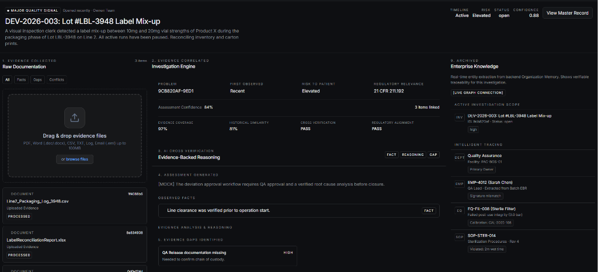

<div align="center">

# Helix

### Enterprise Operational Intelligence for Regulated Manufacturing

## **Evidence before AI. Always.**

Helix introduces **EvidenceOps** — a new category of enterprise software that transforms operational events into explainable, evidence-backed intelligence.

[](https://opensource.org/licenses/MIT)
[](https://www.amd.com/)
[](https://fireworks.ai/)
[]
[]
[]
[]
[]

</div>

---

# Hackathon Quick Links

Judges, please refer to the following architectural documents detailing our exact implementation of the AMD / Fireworks AI ecosystem, our EvidenceOps codebase, and our regulatory design choices:

- **[AMD & Fireworks AI Integration (Pillar 3)](./docs/AMD_FIREWORKS_INTEGRATION.md)** - Details on how we leverage `Gemma-4-31b-it` on MI300X accelerators for sub-second, dense batch record reasoning.
- **[Project Overview & Demo Flow](./docs/PROJECT_OVERVIEW.md)** - A 5-minute read explaining the EvidenceOps architecture.
- **[Regulated System Design (Pillar 1)](./docs/REGULATED_SYSTEM_DESIGN.md)** - How Helix is designed for FDA 21 CFR Part 11/211 compliance (Audit Trails, Determinism).
- **[Main Codepath: Investigation Detail Component](./frontend/src/pages/InvestigationDetailPage.tsx)** - The core React component binding the AI intelligence layer to the canonical Knowledge Graph.
- **[Main Codepath: Context Builder](./backend/src/runtime/context_builder.py)** - The Python service feeding the inference adapter.
- **[Full Documentation Index](./docs/INDEX.md)** - All architecture and API references.

*(For detailed setup and installation instructions, see the [Local Development](#local-development) section at the bottom of this README).*

---

# What is Helix?

Every day, regulated manufacturers generate thousands of operational events:

- Batch Records
- Environmental Monitoring Reports
- Equipment Logs
- Deviations
- Audit Findings
- Calibration Records
- Supplier Documentation
- Customer Complaints

These records contain the evidence required to understand quality events—but today they live across disconnected systems and require days or weeks of manual investigation.

**Helix introduces EvidenceOps.**

Instead of starting with AI, Helix starts with **Enterprise Knowledge**.

Every operational event is verified against organizational knowledge before AI reasoning begins.

Only then does Helix generate explainable assessments, evidence-backed recommendations, and CAPA drafts while keeping humans accountable for regulated decisions.

> **Models observe. Systems decide. Humans remain accountable.**

---

# Why Existing Systems Fail

| Traditional QMS | Generic AI Chatbots | Helix EvidenceOps |
|-----------------|---------------------|-------------------|
| Static forms | Hallucination risk | Evidence-backed reasoning |
| Manual investigations | No auditability | Complete traceability |
| Knowledge silos | No organizational context | Organization Memory |
| Human document search | Generic responses | Deterministic verification |
| Reactive | Reactive | Continuous Operational Intelligence |

---

# Introducing EvidenceOps

EvidenceOps is an operating model where enterprise operations continuously become organizational intelligence.

Instead of asking users to search for documents, Helix continuously:

- Observes operational events
- Retrieves organizational knowledge
- Verifies evidence
- Detects anomalies
- Creates explainable assessments
- Drafts CAPAs
- Preserves historical learning

---

# Enterprise Runtime

```text
Enterprise Knowledge
        │
        ▼
Incoming Operational Event
        │
        ▼
AI Verification & Cross Validation
        │
        ▼
Operational Signal
        │
        ▼
Investigation
        │
        ▼
Evidence Correlation
        │
        ▼
Assessment
        │
        ▼
Evidence Gaps
        │
        ▼
CAPA Recommendation
        │
        ▼
Human Review & Approval
        │
        ▼
Historical Learning
        │
        ▼
Enterprise Knowledge Updated
```

---

# Core Capabilities

### Mission Control

A continuously operating enterprise command center that surfaces operational signals, investigations, CAPAs, and organizational intelligence.

---

### Organization Memory

A canonical representation of enterprise knowledge containing:

- SOPs
- Equipment
- Departments
- Validation Documents
- Historical Investigations
- Historical CAPAs
- Regulatory Knowledge
- Organizational Relationships

---

### Evidence Mapping

Upload operational evidence and automatically correlate it with:

- Equipment
- SOPs
- Personnel
- Facilities
- Historical Investigations
- CAPAs
- Organizational Knowledge

---

### AI Intelligence Layer

Rather than generating free-form responses, the AI layer produces structured, evidence-backed outputs including:

- Assessment Summary
- Observed Facts
- Supporting Evidence
- Evidence Gaps
- Root Cause Candidates
- Recommendations
- Draft CAPA

---

### Explainable Confidence

Every assessment is supported by transparent signals such as:

- Evidence Coverage
- Historical Similarity
- Cross Verification
- Regulatory Alignment

---

### Strategic CAPA Workflow

Generate structured CAPA recommendations while preserving human approval and complete auditability.

---

# Product Walkthrough

## Landing


---

## Mission Control


---

## Investigation Workspace


---

## Evidence Mapping


---

## AI Assessment


---

## CAPA Workflow



---

# Architecture

Helix consists of four logical layers.

## 1. Enterprise Knowledge

Canonical organizational knowledge.

- SOPs
- Equipment
- Facilities
- Departments
- Validation
- Historical Learning

---

## 2. Knowledge Layer

Responsible for:

- Document ingestion
- Canonical extraction
- Embedding generation
- Retrieval

---

## 3. Intelligence Layer

Responsible for:

- Evidence retrieval
- Context assembly
- Structured reasoning
- Assessment generation
- CAPA drafting

---

## 4. Runtime Layer

Coordinates:

- Operational events
- Investigations
- Evidence
- CAPAs
- Audit trail

---

# Technology Stack

### Frontend

- React
- TypeScript
- Vite
- Tailwind CSS
- React Query
- Framer Motion

### Backend

- FastAPI
- SQLAlchemy
- Pydantic
- Alembic

### Database

- PostgreSQL
- pgvector

### AI

- Fireworks AI
- Nomic Embeddings
- Gemma family models (via Fireworks)

### Infrastructure

- Docker
- Nginx
- MinIO
- Redis
- Render
- Vercel
- Neon PostgreSQL

---

# AMD Developer Challenge

Helix uses Fireworks AI to execute structured inference on AMD-powered infrastructure.

Within the MVP:

- Structured JSON reasoning
- Retrieval-augmented context
- Enterprise inference abstraction
- Provider abstraction through the Fireworks adapter

This allows the application to remain model-agnostic while leveraging AMD-backed inference through Fireworks AI.

---

# Demo Scenario

The included demo demonstrates an evidence-backed investigation workflow using a fictional regulated manufacturing organization.

Flow:

1. Login
2. Mission Control
3. Open Investigation
4. Upload Evidence
5. Run Assessment
6. Review Findings
7. Draft CAPA
8. Human Approval

---

# Demo Credentials

Replace with your seeded demo account if applicable.

```
Email:
demo@helix.ai

Password:
********
```

---

# Local Development

## Requirements

- Docker
- Docker Compose
- Fireworks AI API Key

Clone

```bash
git clone https://github.com/<your-repo>/Helix.git
cd Helix
```

Configure

```bash
cp .env.example .env
```

Run

```bash
docker compose up --build
```

Frontend

```
http://localhost:80
```

Backend

```
http://localhost:8000/docs
```

---

*Note: For environments where Docker is unavailable, you can start the FastAPI server via `uvicorn src.main:app --reload` and the React frontend via `npm run dev` directly.*

# Repository Structure

```
frontend/
backend/
docs/
deployment/
knowledge/
demo-data/
```

---

# Roadmap

### Current MVP

✅ Organization Memory

✅ Evidence Mapping

✅ Investigation Workflow

✅ AI Assessment

✅ CAPA Drafting

---

### Next

- Continuous Operational Monitoring
- Automatic Event Detection
- Organization Knowledge Reconstruction
- Multi-tenant Enterprise Memory
- Predictive Operational Intelligence
- Domain Intelligence Packs

---

# Why Helix?

Helix is designed to reduce the time and effort required to investigate regulated operational events by connecting enterprise knowledge, evidence, and AI reasoning into a single explainable workflow.

Rather than replacing experts, Helix helps them make faster, more informed, and traceable decisions.

---

# License

MIT
