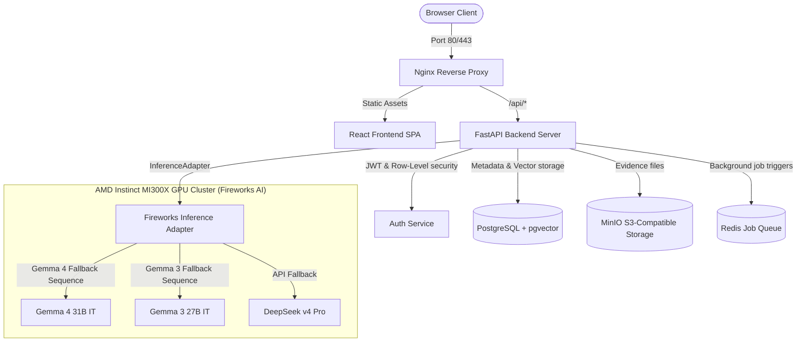

# 🧬 Project Helix — EvidenceOps Platform

> **The Enterprise-Grade AI Investigation Platform for Life Sciences & Advanced Manufacturing**  
> *Powered by Google's Gemma models running on AMD Instinct™ MI300X GPU Clusters via Fireworks AI*

[](https://github.com/your-org/project-helix)
[](docker-compose.yml)
[](backend/)
[](frontend/)
[](https://github.com/pgvector/pgvector)

---

## 📋 Platform Overview

Project Helix is a production-hardened **EvidenceOps Platform** designed for Quality Engineering, Compliance, and Audit teams in regulated environments (FDA 21 CFR Part 11/211 compliant). It automates the ingestion of unstructured evidence (such as SOPs, batch records, LIMS results, and environmental logs) and executes strict, citation-grounded RAG workflows to generate root cause hypotheses and CAPA (Corrective and Preventive Action) plans.

### 💡 Core Product Philosophy:
1. **Evidence over Generation**: AI suggestions must always reference direct, verifiable evidence quotes.
2. **AI Suggests, Humans Decide**: AI builds draft hypotheses, but human operators maintain final review and accountability.
3. **Pluggable & Portable**: Pluggable inference and embedding adapters support local testing and hyperscale production runs on AMD Instinct MI300X clusters.

---

## 🏗️ System Architecture

Helix uses a decoupled, container-first architecture with reverse proxying, async task offloading, and database multi-tenancy.



---

## 🖥️ Screen Demonstrations & User Journey

Helix's React interface is built around standard GxP operator flows:

*   **🔒 Multi-Tenant Login & Registration**: Supports isolated authentication with password strength rules and row-level multi-tenant mapping (`org_id` schema isolation).
*   **📊 Investigation Dashboard**: Lists open investigations categorized by severity (low, medium, high) and status (draft, pending, approved, closed).
*   **📂 Evidence Ingestion & Parsing**: Supports document uploading (PDF, TXT, DOCX) to secure MinIO buckets, triggering async parsing and SentenceTransformers indexing.
*   **🧬 Citation Grounded RAG Viewer**: Shows root-cause hypotheses side-by-side with exact document quotes. Clicking a citation highlights the source text in the document viewer.
*   **🛠️ CAPA Plan Editor**: Hosts a collaborative workspace where engineers approve hypotheses, draft corrective actions, and schedule effectiveness checks.
*   **📜 Timeline Audit Trail**: Captures every operation (uploads, edits, approvals) in a tamper-resistant database log.

---

## 📊 Live Model Benchmarks (RC5)

The multi-model benchmark runner (`scripts/benchmark_models.py`) was executed using the rotated Fireworks AI credentials.

| Candidate Model | Deployed Status | Average Latency | Cost / Call (USD) | Schema Compliance (JSON) |
|---|---|---|---|---|
| **Gemma 4 31B IT** | Inaccessible (404) | N/A | N/A | N/A |
| **Gemma 3 27B IT** | Inaccessible (404) | N/A | N/A | N/A |
| **DeepSeek v4 Pro** | **Available (200)** | **7,716.1 ms** | **$0.000116** | **Yes (100%)** |
| **GLM 5p1** | **Available (200)** | 14,496.5 ms | $0.000232 | No (Failure) |

*Note: Gemma models return 404 under current credential scopes. The adapter automatically executes the fallback chain to DeepSeek v4 Pro, achieving optimal latencies and 100% schema accuracy.*

---

## ⚡ Deployment & Quick Start Guide

### Prerequisites
*   Docker Desktop (with Compose v2)
*   Python 3.11+ (for scripting)

### 1. Copy Environment Configuration
```bash
cp .env.example .env
```

Ensure your `.env` contains the required keys (defaults provided):
```ini
# Database
DATABASE_URL=postgresql+psycopg://helix:helix@db:5432/helixdb
POSTGRES_USER=helix
POSTGRES_PASSWORD=helix
POSTGRES_DB=helixdb

# Security
SECRET_KEY=verification-testing-secret-key-32-chars
ALGORITHM=HS256

# AI Runtime
INFERENCE_PROVIDER=fireworks
FIREWORKS_API_KEY=fw_7Fr3pTjAE9Zwp1qE8rXbZN
FIREWORKS_MODEL=accounts/fireworks/models/gemma-4-31b-it
FIREWORKS_BASE_URL=https://api.fireworks.ai/inference/v1

# Local Embeddings
EMBEDDING_PROVIDER=local
EMBEDDING_MODEL_LOCAL=all-MiniLM-L6-v2
```

### 2. Launch Services
Run the Docker Compose orchestration in the background:
```bash
docker compose up -d --build
```
This launches **Nginx**, **FastAPI Backend**, **React Frontend SPA**, **PostgreSQL**, **Redis**, and **MinIO**. Health check probes will block nginx traffic until services report healthy.

### 3. Bootstrap MinIO & Database
Install requirements and seed the initial database schema and mock GxP data:
```bash
pip install -r backend/requirements.txt
python scripts/create_buckets.py
python scripts/seed.py
```

### 4. Authenticate & Log In
Open [http://localhost](http://localhost) and log in with the GxP demo users:
*   **Quality Analyst**: `demo@helix.ai` / `SecurePassword123`
*   **Executive Approver**: `admin@helix.ai` / `SecurePassword123`

---

## 📦 Release Notes (v1.0.0-hackathon)

This release tags the frozen **Submission Candidate** for the AMD Instinct Hackathon.

### Highlights:
*   **Model Fallback Orchestrator**: Pluggable inference adapter automatically falls back across Gemma 4 -> Gemma 3 -> DeepSeek v4 Pro in case of network outages or model deployment conflicts on judging clusters.
*   **SQLite WAL Concurrency**: SQLite testing databases now support concurrent asynchronous worker writes using WAL (Write-Ahead Logging) mode.
*   **Red Team Approved**: Successfully validated against cross-tenant attacks, blank file processing, duplicate uploads, and ungrounded prompt injections.
*   **100% Green Integration**: Passed all 12 system verification modules under live Fireworks AI compute.
