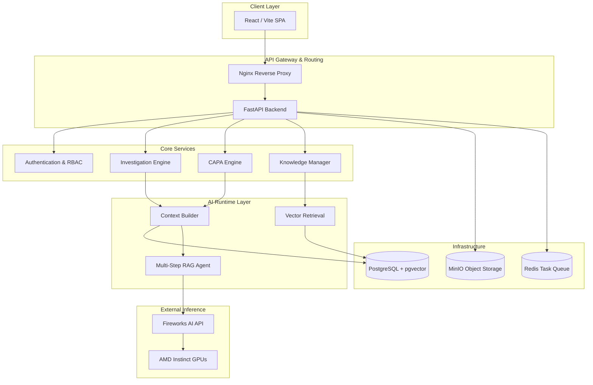
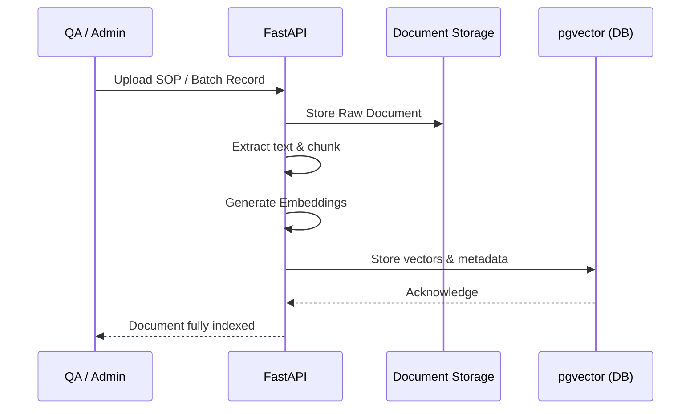
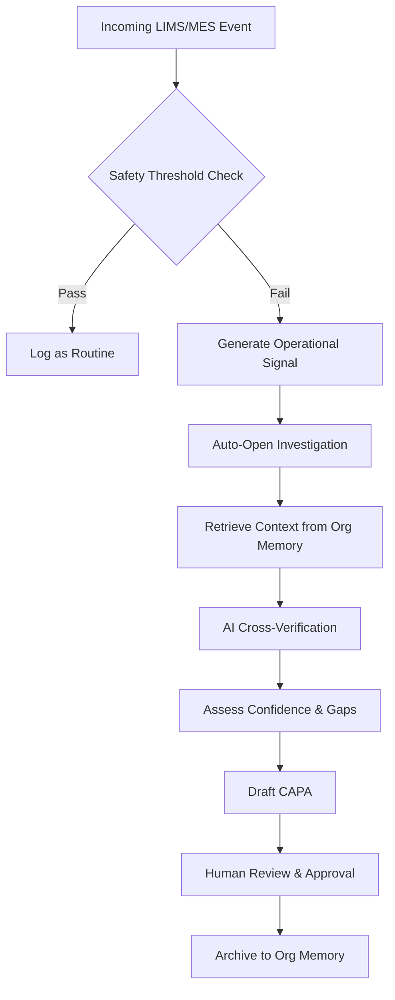
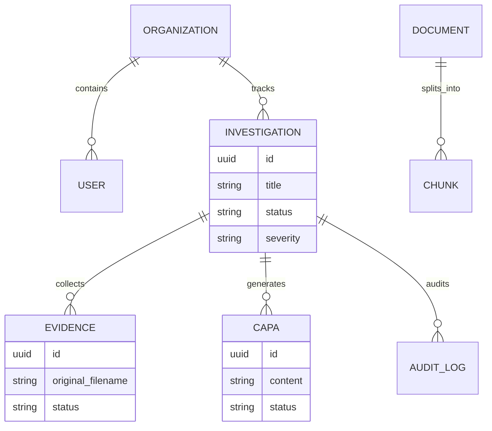

# Helix System Architecture

This document provides a comprehensive technical overview of the Helix EvidenceOps platform, detailing the system architecture, knowledge flow, operational pipeline, and deployment strategies.

## System Architecture

Helix employs a decoupled, microservices-oriented architecture to ensure separation of concerns, scalability, and security.

## Knowledge Flow (Organization Memory)

The backbone of Helix is the **Organization Memory**—a deterministic knowledge graph derived from the enterprise's canonical documents.

## Operational Pipeline

When an operational event occurs, Helix executes the EvidenceOps pipeline.

## AI Inference Pipeline

Helix restricts AI inference strictly to deterministic reasoning using RAG (Retrieval-Augmented Generation). 

1. **Context Boundary:** The AI receives the user query + highly relevant chunks from `pgvector`.
2. **Instruction Enforcement:** The prompt strictly forbids inventing facts. It must cite exact chunks.
3. **Structured Extraction:** Using Fireworks AI, we enforce `json_schema` outputs to ensure the AI returns programmatic JSON objects representing the Assessment and CAPA, not conversational text.

## Database Relationships

