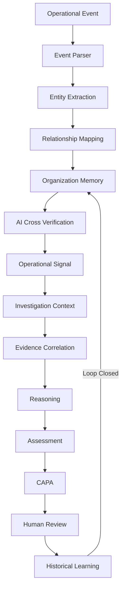
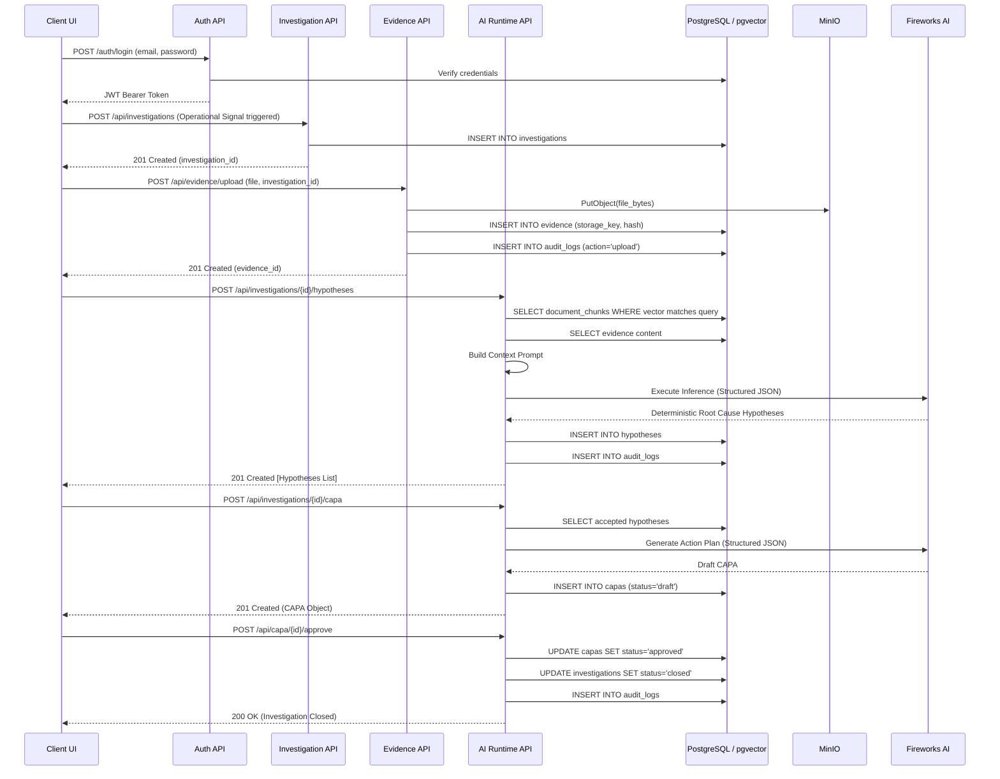
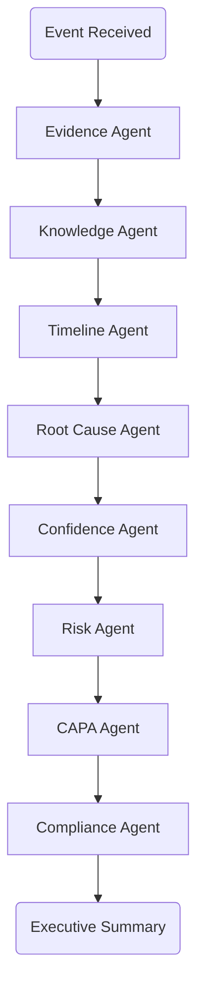
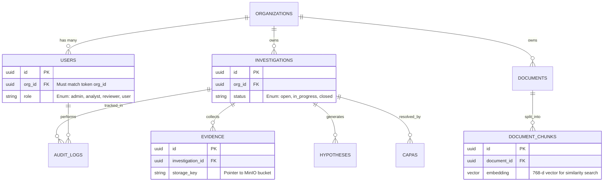

# Helix Runtime Architecture — EvidenceOps Execution Engine

This document provides a highly detailed mapping of the Helix execution runtime. It defines the behavioral models, system topology, data structures, and enterprise guarantees necessary to operate an AI-native Enterprise Operating System in highly regulated industries.

---

## 1. Runtime Principles

The Helix engine operates under a strict set of deterministic principles:
* Everything entering Helix is treated as an **Operational Event**.
* Every event is parsed into structured knowledge.
* AI never reasons without evidence.
* Every conclusion references supporting evidence.
* Every decision is explainable.
* Humans remain accountable for regulated decisions.
* Every completed investigation strengthens Organization Memory.

---

## 2. The EvidenceOps Operating Model

Unlike a standard CRUD application, the Helix architecture is designed as a continuous loop of verification, reasoning, and archival.



---

## 3. Runtime Execution Pipeline

When an operational event breaches safety thresholds, the execution pipeline automatically triggers a deterministic sequence bridging human input, the `pgvector` knowledge graph, and the Fireworks AI inference engine.



---

## 4. AI Agent Execution Flow

To process complex quality investigations autonomously, Helix orchestrates specialized reasoning agents synchronously within the runtime.



---

## 5. Strict Relational Data Pointers

To render the architecture seamlessly on any interface, the UI must respect the backend's strict foreign key relationships and multi-tenant isolation. Every entity relies heavily on UUID pointers.



---

## 6. Confidence Engine

Helix does not rely on subjective AI hallucination. The **Confidence Score** is mathematically derived from the following vectors during the runtime execution:
* **Evidence Coverage:** Percentage of the operational event corroborated by physical data logs.
* **Historical Similarity:** Proximity vector to historical CAPAs within the Organization Memory.
* **Cross Verification Success:** Validation against active SOP thresholds.
* **Regulatory Alignment:** Verification against relevant regulatory citations (e.g., 21 CFR 211).
* **Missing Evidence Penalty:** Deductions applied if chronological links in the chain-of-custody are absent.
* **Contradiction Penalty:** Deductions applied if raw evidence conflicts with stated human hypotheses.

---

## 7. Explainability Contract

To maintain 21 CFR Part 11 and general regulatory compliance, every AI inference passed through the Helix engine is bound by an Explainability Contract. Every structured JSON output from the Fireworks API MUST include:

```json
{
  "evidence_used": ["..."],
  "knowledge_referenced": ["..."],
  "reasoning_steps": ["..."],
  "confidence": 0.88,
  "evidence_gaps": ["..."],
  "alternative_hypotheses": ["..."],
  "recommended_actions": ["..."]
}
```

---

## 8. Enterprise Runtime Guarantees

Any UI framework connecting to the Helix backend must adhere to the following guarantees established by the FastAPI routing layer:

* **Tenant Isolation:** The frontend NEVER transmits an `org_id`. The backend infers isolation directly from the cryptographic JWT, guaranteeing zero data bleed between tenants.
* **Immutable Audit Trail:** There are no `DELETE` or `PUT` endpoints exposed for Audit Logs or finalized evidence. The runtime strictly rejects mutations to historical facts.
* **Explainability:** All AI assertions maintain a foreign-key pointer back to the raw `document_chunk_id` that inspired them.
* **Human Approval:** The runtime structurally prevents an Investigation status from changing to `closed` without a `POST /approve` call bound to a human actor's UUID.
* **Role-Based Access Control (RBAC):** Inference generation requires `analyst` privileges; CAPA approvals require `reviewer` privileges. 
* **Traceability:** Every mutation is chronologically written to the `audit_logs` relation before 201 responses are sent.
* **Event Sourcing:** The current state of an investigation is inherently reproducible by re-running its audit log from inception.

---

## 9. The Behavioral Contract

Helix does not automate regulated decisions. It automates evidence collection, verification, correlation, and reasoning while ensuring every conclusion remains transparent, traceable, and evidence-backed. Human users remain accountable for approvals, while every completed investigation enriches Organization Memory and improves future investigations.
