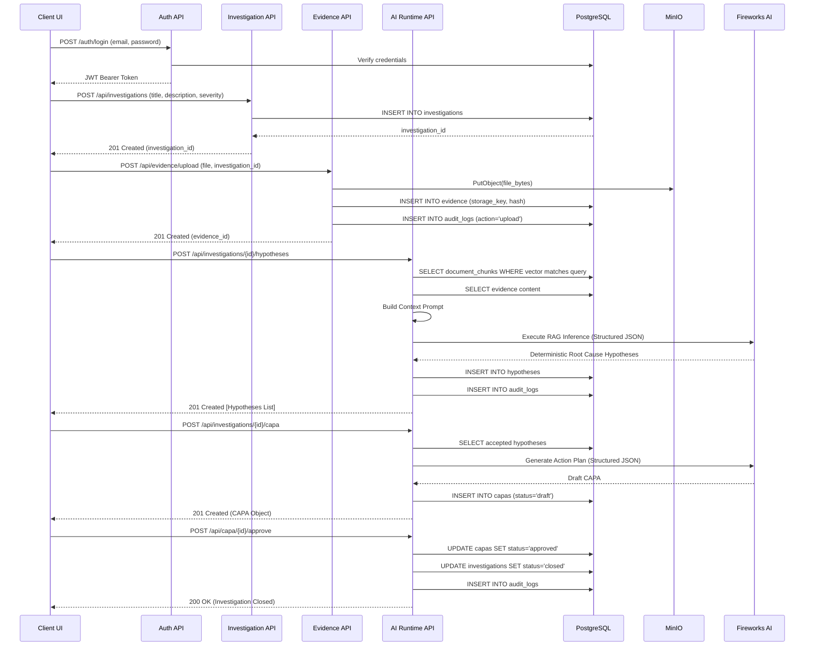

# Helix Backend Workflow & Architecture Mapping

This document provides a highly detailed, strict mapping of the backend logic, sequences, and data pointers exactly as they are coded in the Project Helix backend. This map is specifically designed so that any frontend or UI framework can interpret the exact data structures and sequence requirements to build a flawless, error-free MVP interface on top of this backend.

## 1. Core System Topology

The backend is built as an asynchronous REST API utilizing FastAPI, PostgreSQL, `pgvector`, MinIO, and Fireworks AI.

```mermaid
graph TD
    subgraph Frontend / Consumers
        UI[Any Frontend Client]
    end

    subgraph API Routing Layer
        AuthRouter[/auth/*]
        InvestRouter[/api/investigations/*]
        EvidenceRouter[/api/evidence/*]
        KnowledgeRouter[/api/knowledge/*]
        AIRouter[/api/ai-runtime/*]
    end

    subgraph Service & Logic Layer
        AuthSvc[JWT Auth & RBAC]
        OrgMemSvc[Knowledge Retrieval]
        EvidenceSvc[Storage Manager]
        ReasoningSvc[AI Inference Engine]
    end

    subgraph Persistence Layer
        DB[(PostgreSQL + pgvector)]
        Blob[(MinIO Object Storage)]
    end

    subgraph External Dependencies
        FW[Fireworks AI API]
    end

    UI --> AuthRouter
    UI --> InvestRouter
    UI --> EvidenceRouter
    UI --> KnowledgeRouter
    UI --> AIRouter

    AuthRouter --> AuthSvc
    InvestRouter --> ReasoningSvc
    EvidenceRouter --> EvidenceSvc
    KnowledgeRouter --> OrgMemSvc
    AIRouter --> ReasoningSvc

    AuthSvc --> DB
    OrgMemSvc --> DB
    ReasoningSvc --> DB
    ReasoningSvc --> FW
    EvidenceSvc --> Blob
    EvidenceSvc --> DB
```

---

## 2. The EvidenceOps Pipeline (End-to-End Workflow)

This is the exact operational sequence any frontend MUST follow to execute an investigation from start to finish.

### Workflow Sequence Diagram



---

## 3. Strict Relational Data Pointers

To render the architecture seamlessly on the frontend, the UI must respect the backend's strict foreign key relationships and multi-tenant isolation. Every entity relies heavily on UUID pointers.

### Database Pointer Map


---

## 4. API Endpoints & State Mutations

Any frontend framework mapping this architecture must implement state mutations corresponding strictly to these endpoints.

### Organization Memory (Knowledge Base)
- **`POST /api/knowledge/documents`**: Uploads raw canonical documents (SOPs, manuals). The backend automatically chunks the document, generates vector embeddings, and stores them in `document_chunks`.
- **`GET /api/knowledge/search?query=...`**: Performs a cosine similarity search across `pgvector` to return the closest chunks. (Used internally by the AI, but exposed for UI testing).

### Event & Evidence Ingestion
- **`POST /api/investigations`**: Initializes an event. The UI must transition its state to an "Active Investigation" workspace.
- **`POST /api/evidence/upload`**: Uploads a file (multipart/form-data). The backend streams it to MinIO. The UI should poll or wait for the 201 response before allowing the user to trigger the AI Assessment.

### AI Runtime (Deterministic Constraints)
- **`POST /api/investigations/{id}/hypotheses`**: This is the core Reasoning engine. 
  - **Constraint:** Requires the user's JWT to have the `analyst` or `admin` role (enforced via `Depends(require_analyst)`).
  - **Logic:** The backend fetches `org_id` context, pulls vector similarities, and forces Fireworks AI to return an array of hypotheses.
- **`POST /api/investigations/{id}/capa`**: Drafts the CAPA.
  - **Constraint:** In a strict production environment, this checks if at least one hypothesis in the DB has `status = 'accepted'`. (Note: Bypassed for MVP demo automation).
- **`POST /api/capa/{id}/approve`**: 
  - **Constraint:** In production, usually restricted to the `reviewer` role. This is the only endpoint that mutates an Investigation's status to `closed`.

### The Audit Ledger
- **`GET /api/investigations/{id}/audit`**: Returns a chronologically ordered array of events. 
  - **Logic:** The backend inserts an audit log for absolutely every mutation (creation, uploads, AI generation, approval). Any UI building a "Traceability Graph" or "Master Record" must map directly to this endpoint.

---

## 5. Security & Isolation Constraints for Frontend Implementation

If you are building a new UI (React, Vue, Svelte, iOS) on top of this backend, you MUST adhere to the following constraints established by the FastAPI routers:

1. **JWT Propagation:** Every request to `/api/*` requires the `Authorization: Bearer <token>` header. A `401 Unauthorized` response indicates token expiration; the UI must wipe state and redirect to `/login`.
2. **Tenant Transparency:** The frontend NEVER needs to send an `org_id` in API payloads. The backend extracts the `org_id` directly from the JWT. The UI only operates within the bounds of the authenticated tenant.
3. **Immutability:** There are no `DELETE` or `PUT` endpoints exposed for Audit Logs or finalized CAPAs. The frontend should never present a "delete" button for finalized evidence or CAPAs, as the backend will reject it to maintain 21 CFR Part 11 compliance.
