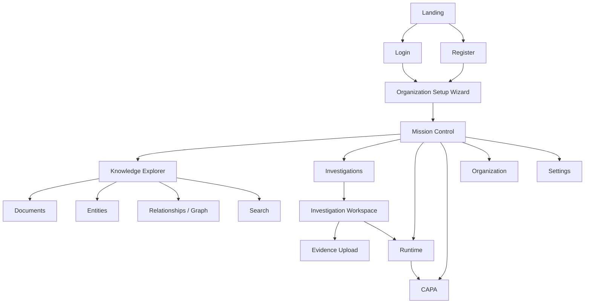
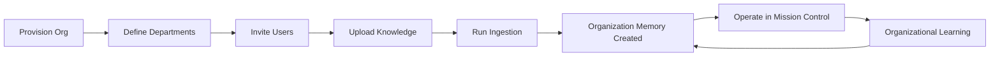
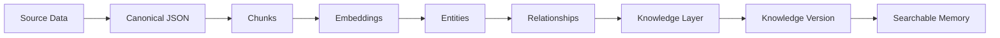
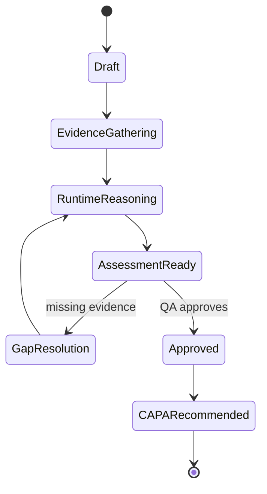
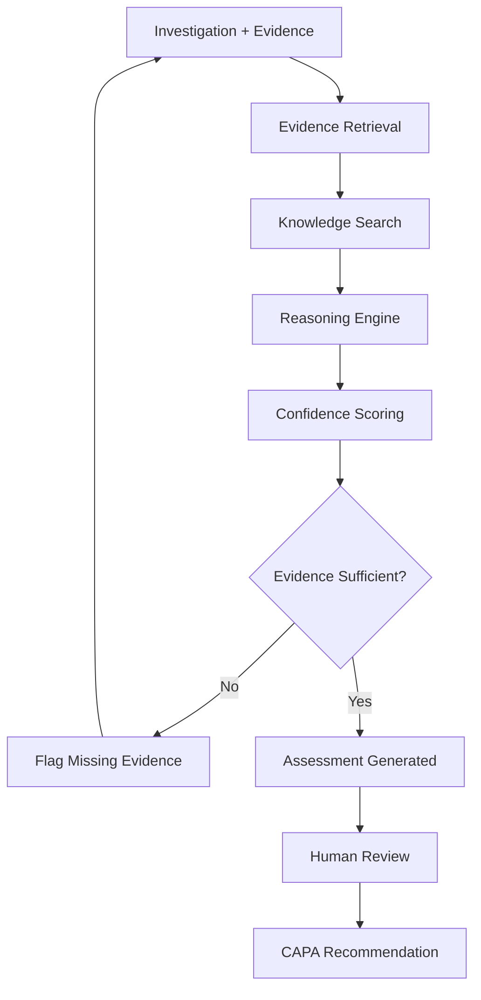
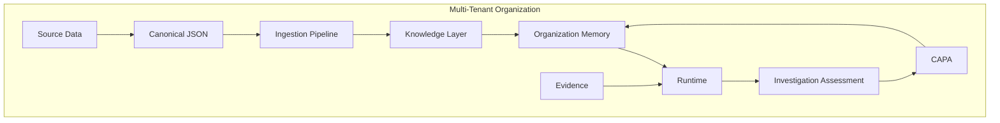

# HELIX — Phase 2: Information Architecture

> **Status:** DRAFT FOR APPROVAL — no UI or React code will be generated until this document is approved.
>
> **Product:** Helix, an enterprise **EvidenceOps Platform** for regulated industries.
>
> **Core narrative every screen must express:**
> Organization Knowledge → Organization Memory → Evidence → Intelligence → Assessment → CAPA → Organizational Learning.
>
> **Prime directive:** Models observe, systems decide, humans remain accountable. Evidence before AI. Always.

---

## 0. Governing Principles (apply to every screen)

1. **No teleporting.** Every screen answers "where did the user come from, where can they go." Navigation is a continuous spatial system, not a set of isolated pages.
2. **Inherited design language.** Every screen inherits the frozen Landing Page's typography, spacing, color, motion, and interaction philosophy. This is one product, not a gallery of pages.
3. **Backend-sourced truth.** Every user-facing number, list, status, and artifact originates from a backend API backed by Neon PostgreSQL. Seeded demo data in the database is acceptable; **hardcoded values inside React components are forbidden.**
4. **Tenant-derived context.** The active organization is always resolved from the authenticated tenant/session. The frontend never assumes "Apex Precision" (or any org) by name.
5. **Evidence-first, human-accountable.** Intelligence output is never presented as autonomous truth. Confidence, missing evidence, and citations are always visible; CAPA is always human-approved.
6. **Spec before screen.** Each screen has a written specification (purpose, user, hierarchy, backend mapping, components, states) before it is built.

### Data flow doctrine (teach the architecture through the UI)

```
Seed Data → Neon Database → Backend APIs → Data layer (React Query/SWR) → Frontend
```

Never:

```
React Component → const stats = [ ...hardcoded... ]
```

---

## 1. Complete Product Navigation

### 1.1 Navigation zones

Helix has three navigation contexts. A screen belongs to exactly one.

| Zone | Purpose | Chrome | Auth |
| --- | --- | --- | --- |
| **Public** | Convince the enterprise buyer | Marketing header + footer | None |
| **Onboarding** | Build the organization's intelligence | Minimal wizard chrome, progress rail | Authenticated, no org yet |
| **Platform** | Operate the EvidenceOps system | Persistent left rail + top context bar | Authenticated + active org |

### 1.2 Screen map

```
PUBLIC
├── Landing                       /
├── Login                         /login
└── Register                      /register

ONBOARDING (authenticated, org not yet provisioned)
└── Organization Setup Wizard     /setup
    ├── Welcome                    /setup/welcome
    ├── Organization Details       /setup/organization
    ├── Departments                /setup/departments
    ├── Invite Users               /setup/invite
    ├── Upload Knowledge           /setup/knowledge
    ├── Run Ingestion              /setup/ingestion
    └── Memory Created             /setup/complete

PLATFORM (authenticated + active org)
├── Mission Control               /app
├── Knowledge Explorer            /app/knowledge
│   ├── Documents                  /app/knowledge/documents
│   ├── Document Detail            /app/knowledge/documents/:id
│   ├── Entities                   /app/knowledge/entities
│   ├── Relationships / Graph      /app/knowledge/graph
│   └── Search                     /app/knowledge/search
├── Investigations                /app/investigations
│   ├── Investigation Workspace    /app/investigations/:id
│   └── Evidence Upload            /app/investigations/:id/evidence
├── Runtime                       /app/runtime
│   └── Run Detail                 /app/runtime/:runId
├── CAPA                          /app/capa
│   └── CAPA Detail                /app/capa/:id
├── Organization                  /app/organization
└── Settings                      /app/settings
    ├── General                    /app/settings/general
    ├── Users                       /app/settings/users
    ├── Departments                 /app/settings/departments
    ├── Knowledge                   /app/settings/knowledge
    ├── Runtime                      /app/settings/runtime
    ├── Security                     /app/settings/security
    ├── Audit                        /app/settings/audit
    └── Integrations                 /app/settings/integrations
```

### 1.3 Persistent platform navigation (left rail)

Grouped to mirror the EvidenceOps lifecycle, not generic CRUD:

- **Overview** — Mission Control
- **Knowledge** — Knowledge Explorer (Organization Memory)
- **Operate** — Investigations, Runtime, CAPA
- **Administer** — Organization, Settings

Top context bar (all platform screens): active organization switcher, knowledge version chip, global evidence search, notifications, account.

---

## 2. User Personas

For each: goals, responsibilities, permissions, primary workflows.

### 2.1 Organization Admin
- **Goals:** Stand up the org's intelligence; control access; guarantee governance.
- **Responsibilities:** Org provisioning, departments, user lifecycle, security/audit posture.
- **Permissions:** Full tenant scope — manage org, users, departments, integrations, security, audit; read all investigations/knowledge.
- **Primary workflows:** Onboarding wizard, inviting departments/users, configuring runtime + security, reviewing audit log.

### 2.2 QA Manager
- **Goals:** Ensure investigations are evidence-backed and CAPAs prevent recurrence.
- **Responsibilities:** Own investigation quality, approve/route assessments, own CAPA lifecycle.
- **Permissions:** Create/assign investigations; approve assessments; create/approve/close CAPA; manage knowledge within department scope.
- **Primary workflows:** Investigation triage, assessment review, CAPA approval, recurrence monitoring.

### 2.3 Manufacturing Engineer
- **Goals:** Resolve deviations on the line quickly with defensible reasoning.
- **Responsibilities:** Supply process/equipment context, upload line evidence, implement CAPA actions.
- **Permissions:** Contribute evidence; view investigations + knowledge in their department; execute assigned CAPA actions.
- **Primary workflows:** Evidence upload, reviewing runtime reasoning, executing CAPA tasks.

### 2.4 Investigator
- **Goals:** Build a complete, traceable evidence chain and reach a sound assessment.
- **Responsibilities:** Drive the investigation loop, gather evidence, run the runtime, resolve gaps.
- **Permissions:** Full CRUD on assigned investigations + their evidence; trigger runtime; draft assessments (approval by QA Manager).
- **Primary workflows:** Investigation Workspace, evidence upload, runtime execution, gap resolution, drafting assessment.

### 2.5 Auditor
- **Goals:** Verify every decision is traceable to evidence and knowledge version.
- **Responsibilities:** Independent review; export defensible records.
- **Permissions:** **Read-only** across investigations, evidence, assessments, CAPA, knowledge, and audit log. No mutation anywhere.
- **Primary workflows:** Audit log review, traceability drill-down (assessment → evidence → source doc → knowledge version), export.

### 2.6 Executive
- **Goals:** Confidence that risk is controlled and the organization is learning.
- **Responsibilities:** Oversight of health, throughput, and recurrence trends.
- **Permissions:** Read-only aggregate views; no operational mutation.
- **Primary workflows:** Mission Control monitoring, trend/health review, drill-down into flagged investigations.

### 2.7 Permission matrix (summary)

| Capability | Admin | QA Mgr | Mfg Eng | Investigator | Auditor | Exec |
| --- | :-: | :-: | :-: | :-: | :-: | :-: |
| Manage org/users/security | ✅ | — | — | — | — | — |
| Create investigation | ✅ | ✅ | — | ✅ | — | — |
| Upload evidence | ✅ | ✅ | ✅ | ✅ | — | — |
| Trigger runtime | ✅ | ✅ | — | ✅ | — | — |
| Approve assessment | ✅ | ✅ | — | — | — | — |
| Approve/close CAPA | ✅ | ✅ | — | — | — | — |
| Read knowledge/graph | ✅ | ✅ | ✅ | ✅ | ✅ | ✅ |
| Read audit log | ✅ | ✅ | — | — | ✅ | ✅ |
| Mutate anything | ✅ | scoped | scoped | scoped | ❌ | ❌ |

---

## 3. User Journeys (end-to-end)

### 3.1 First-time organization onboarding
Register → verify → land in Setup Wizard (no org) → Welcome frames "you are building your organization's intelligence" → Organization Details → Departments → Invite Users → Upload Knowledge → Run Ingestion (live progress) → **Organization Memory Created** confirmation → redirect to Mission Control (now populated from backend).

### 3.2 Organization knowledge creation
Admin uploads SOPs/specs/batch records → files become **Source Data** → Ingestion Pipeline produces **Canonical JSON** → chunking/embeddings build the **Knowledge Layer** (chunks, entities, relationships) → knowledge version increments → visible in Knowledge Explorer.

### 3.3 Admin inviting departments and users
Settings → Departments (create plant/line/function structure) → Users (invite by email, assign role + department) → invitee accepts → role-scoped access applied → appears in org roster.

### 3.4 Knowledge ingestion
Upload → Source Data registered → pipeline stages (parse → canonicalize → chunk → embed → extract entities → link relationships) stream status → completion updates Knowledge stats and version; failures surface per-document with retry.

### 3.5 Investigation lifecycle
Create investigation (deviation/event) → assemble evidence (timeline + uploads) → run Runtime against Organization Memory → review Assessment (confidence, citations, **missing evidence**) → resolve gaps / re-run → QA Manager approves assessment → recommend CAPA.

### 3.6 Evidence upload
Within an investigation → Evidence Upload → files/records attach to timeline → each item linked to source + timestamp → evidence becomes retrievable by Runtime → evidence completeness indicator updates.

### 3.7 Intelligence assessment
Runtime retrieves evidence + searches knowledge → reasoning engine produces assessment → UI shows retrieved documents, reasoning trace, confidence %, missing-evidence list, citations → human reviews; assessment is never auto-final.

### 3.8 CAPA lifecycle
Assessment → CAPA recommended (draft, human-gated) → QA Manager approves → corrective + preventive actions assigned to engineers → actions executed/verified → CAPA closed → outcome feeds back as **Organizational Learning** (knowledge/memory update).

### 3.9 Executive monitoring
Executive opens Mission Control → aggregate health, active investigations, runtime status, recurrence trends → drills into a flagged investigation (read-only) → confidence that risk is controlled and the org is learning.

---

## 4. Mermaid Diagrams

### 4.1 Navigation hierarchy


### 4.2 Organization lifecycle


### 4.3 Knowledge lifecycle


### 4.4 Investigation lifecycle


### 4.5 Runtime pipeline


### 4.6 EvidenceOps architecture


---

## 5. Screen Inventory

Each screen: Purpose · Primary user · Main CTA · Backend APIs · Data sources · Components · Loading / Empty / Error / Success states.

> Endpoint names below express the **expected contract** against the existing Helix backend layers (Multi-tenant Organizations, Organization Memory, Source Data, Canonical JSON, Ingestion Pipeline, Knowledge Layer, Runtime, Investigation Assessment, CAPA). They must be reconciled with the real backend before wiring — the frontend adapts to the backend, never the reverse.

### 5.1 Landing `/`
- **Purpose:** Convince a Fortune-500 QA/Regulatory buyer that Helix is an EvidenceOps operating system, not a chatbot.
- **Primary user:** Enterprise buyer (Exec / QA Director).
- **Main CTA:** Request Enterprise Demo.
- **APIs:** None (public/static).
- **Data sources:** None; illustrative runtime visualization must be clearly framed as a product depiction.
- **Components:** Story hero with **live runtime visualization as the centerpiece**, problem framing ("why AI hallucinates in regulated industries"), EvidenceOps lifecycle, Organization Memory architecture, evidence→intelligence pipeline, auditability/traceability, security & multi-tenancy, enterprise integrations, demo workflow, footer.
- **States:** Static; no data states.

### 5.2 Login `/login`
- **Purpose:** Professional, minimal enterprise authentication.
- **Primary user:** All returning users.
- **Main CTA:** Sign in.
- **APIs:** `POST /auth/session` (email + password).
- **Data sources:** Auth/session.
- **Components:** Email/password form, error region, link to Register.
- **States:** Loading (submitting) · Empty (fresh form) · Error (invalid credentials) · Success (route to Setup or Mission Control based on org existence).

### 5.3 Register `/register`
- **Purpose:** Create an account that will provision an organization.
- **Primary user:** Prospective Organization Admin.
- **Main CTA:** Create account.
- **APIs:** `POST /auth/register`.
- **States:** Loading · Empty · Error (email in use, weak password) · Success → Setup Wizard.

### 5.4 Organization Setup Wizard `/setup/*`
- **Purpose:** Make the user feel they are **building their organization's intelligence**, not uploading files.
- **Primary user:** Organization Admin.
- **Main CTA (per step):** Continue → final Enter Mission Control.
- **APIs by step:**
  - Organization Details → `POST /organizations`
  - Departments → `POST /organizations/:id/departments`
  - Invite Users → `POST /organizations/:id/invitations`
  - Upload Knowledge → `POST /organizations/:id/source-data`
  - Run Ingestion → `POST /organizations/:id/ingestion` + `GET /ingestion/:jobId` (status stream)
  - Complete → `GET /organizations/:id/memory`
- **Data sources:** Organization, Departments, Users/Invitations, Source Data, Ingestion Pipeline, Organization Memory.
- **Components:** Progress rail, step forms, uploader, live ingestion progress, "Memory Created" confirmation.
- **States:** Loading (per submit) · Empty (each step start) · Error (validation, upload/ingestion failure with retry) · Success (advance; final redirect to Mission Control).

### 5.5 Mission Control `/app`
- **Purpose:** The operational heart — the first screen after setup. Three-column command surface, not a dashboard.
- **Primary user:** QA Manager / Executive / Admin.
- **Main CTA:** Open / create investigation.
- **APIs:** `GET /organizations/:id`, `GET /organizations/:id/knowledge/stats`, `GET /organizations/:id/runtime/status`, `GET /organizations/:id/investigations`, `GET /organizations/:id/notifications`.
- **Data sources:** Organization, Knowledge Layer stats, Runtime status, Investigations, Notifications.
- **Layout:**
  - **Left:** Organization identity, knowledge status, knowledge version.
  - **Center:** Investigations, recent activity, runtime.
  - **Right:** AI intelligence summary, health, notifications, quick actions.
- **States:** Loading (skeleton per panel) · Empty (no investigations → guide to first one) · Error (per-panel retry) · Success (all metrics from APIs, never hardcoded).

### 5.6 Knowledge Explorer `/app/knowledge/*`
- **Purpose:** Make Organization Memory tangible: Documents → Canonical → Chunks → Entities → Relationships → Search → Graph.
- **Primary user:** Investigator / QA Manager / Auditor.
- **Main CTA:** Search knowledge / open document.
- **APIs:** `GET /knowledge/documents`, `GET /knowledge/documents/:id` (+ canonical, chunks), `GET /knowledge/entities`, `GET /knowledge/graph`, `POST /knowledge/search`.
- **Data sources:** Source Data, Canonical JSON, Knowledge Layer (chunks/entities/relationships).
- **Components:** Document table, document detail (source ↔ canonical ↔ chunks), entity browser, relationship graph, semantic search with citations.
- **States:** Loading · Empty (no knowledge → prompt ingestion) · Error · Success.

### 5.7 Investigations `/app/investigations`
- **Purpose:** Portfolio of investigations with status and evidence completeness.
- **Primary user:** QA Manager / Investigator.
- **Main CTA:** New investigation.
- **APIs:** `GET /investigations`, `POST /investigations`.
- **States:** Loading · Empty (create first) · Error · Success.

### 5.8 Investigation Workspace `/app/investigations/:id`
- **Purpose:** The core loop — feels like "flying an aircraft," not "reading cards": Evidence → Timeline → Assessment → Recommendations → CAPA → Runtime.
- **Primary user:** Investigator.
- **Main CTA:** Run assessment / advance state.
- **APIs:** `GET /investigations/:id`, `GET /investigations/:id/evidence`, `GET /investigations/:id/timeline`, `POST /runtime/runs`, `GET /investigations/:id/assessment`, `POST /capa`.
- **Data sources:** Investigation, Evidence, Runtime, Investigation Assessment, CAPA.
- **Components:** Evidence rail, timeline, runtime reasoning trace, assessment panel (confidence, citations, missing evidence), recommendation → CAPA action.
- **States:** Loading · Empty (no evidence → upload) · Error (runtime failure/retry) · Success (assessment with confidence + gaps + citations).

### 5.9 Evidence Upload `/app/investigations/:id/evidence`
- **Purpose:** Attach evidence to the investigation timeline for retrieval.
- **Primary user:** Investigator / Manufacturing Engineer.
- **Main CTA:** Upload evidence.
- **APIs:** `POST /investigations/:id/evidence`, `GET /investigations/:id/evidence`.
- **States:** Loading (upload) · Empty · Error (rejected file/retry) · Success (attached, completeness updates).

### 5.10 Runtime `/app/runtime` (+ `/:runId`)
- **Purpose:** Observability into the reasoning pipeline (retrieval → search → reasoning → confidence → assessment).
- **Primary user:** Investigator / QA Manager / Auditor.
- **Main CTA:** Inspect run.
- **APIs:** `GET /runtime/runs`, `GET /runtime/runs/:runId`, `GET /organizations/:id/runtime/status`.
- **States:** Loading · Empty (no runs) · Error · Success.

### 5.11 CAPA `/app/capa` (+ `/:id`)
- **Purpose:** Manage corrective/preventive actions, human-gated, closing the learning loop.
- **Primary user:** QA Manager.
- **Main CTA:** Approve / assign / close CAPA.
- **APIs:** `GET /capa`, `GET /capa/:id`, `POST /capa/:id/approve`, `PATCH /capa/:id`.
- **States:** Loading · Empty · Error · Success (state transition + learning feedback).

### 5.12 Organization `/app/organization`
- **Purpose:** Org identity, departments, membership overview.
- **Primary user:** Admin / Executive.
- **APIs:** `GET /organizations/:id`, `GET /organizations/:id/departments`, `GET /organizations/:id/members`.
- **States:** Loading · Empty · Error · Success.

### 5.13 Settings `/app/settings/*`
- **Purpose:** Enterprise administration: General, Users, Departments, Knowledge, Runtime, Security, Audit, Integrations.
- **Primary user:** Admin (Audit also Auditor, read-only).
- **APIs:** `GET/PATCH /organizations/:id`, `GET/POST /organizations/:id/members`, `GET/POST /organizations/:id/departments`, `GET /organizations/:id/knowledge/settings`, `GET/PATCH /organizations/:id/runtime/settings`, `GET/PATCH /organizations/:id/security`, `GET /organizations/:id/audit`, `GET/POST /organizations/:id/integrations`.
- **States:** Loading · Empty · Error · Success per tab.

---

## 6. Backend Mapping

The frontend adapts to the **existing** Helix backend. No new backend, no changed API contracts.

| Backend layer | Feeds screens | Primary read/writes |
| --- | --- | --- |
| Multi-tenant Organizations | Setup, Mission Control, Organization, Settings | org identity, members, departments, tenant resolution |
| Source Data | Setup (upload), Knowledge Explorer | uploaded raw documents/records |
| Canonical JSON | Knowledge Explorer (document detail) | normalized document representation |
| Ingestion Pipeline | Setup (ingestion), Knowledge stats | job status, stages, failures |
| Knowledge Layer | Mission Control, Knowledge Explorer | chunks, entities, relationships, version, search |
| Organization Memory | Setup (complete), Mission Control | consolidated retrievable memory |
| Runtime | Investigation Workspace, Runtime | evidence retrieval, reasoning, confidence |
| Investigation Assessment | Investigation Workspace | assessment, citations, missing evidence |
| CAPA | Investigation Workspace, CAPA | recommendation, approval, actions, closure |

**Tenant rule:** every request is scoped by the authenticated tenant; the active organization is resolved from session, never hardcoded by name (seed org "Apex Precision" is treated exactly like a production customer).

**Data-integrity rule:** if a value is not returned by an API, it does not appear in the UI. No placeholder metrics (`15 Documents`, `662 Chunks`) baked into components.

---

## 7. Design Constraints

**Do NOT generate:** generic admin dashboards, CRM layouts, sales analytics, marketing metrics, pie charts, finance widgets, AI-chatbot layouts.

**Design as an enterprise operating system** inspired by Palantir Foundry, Linear, OpenAI Platform, Stripe Dashboard, and Vercel: restrained, dense-but-calm, evidence-forward, thin borders, generous whitespace, one signal accent, motion used only to explain system state.

**Every screen must communicate the arc:**

```
Organization Knowledge → Organization Memory → Evidence → Intelligence → Assessment → CAPA → Organizational Learning
```

---

## 8. Build Sequence (post-approval)

```
Product DNA → Information Architecture → Design System → Landing (refine + freeze)
→ Login → Organization Setup Wizard → Mission Control
→ Investigation Workspace → Knowledge Explorer → Settings/Admin
```

Rules for each subsequent screen:
1. Start from the previously approved screen; inherit its design language.
2. Write a per-screen specification (purpose, user, hierarchy, backend mapping, components, states) before UI.
3. Wire all data through the Neon-backed APIs; zero hardcoded values.
4. Preserve navigational continuity — never teleport.

> **Awaiting approval of this Information Architecture before any UI or React code is generated.**
